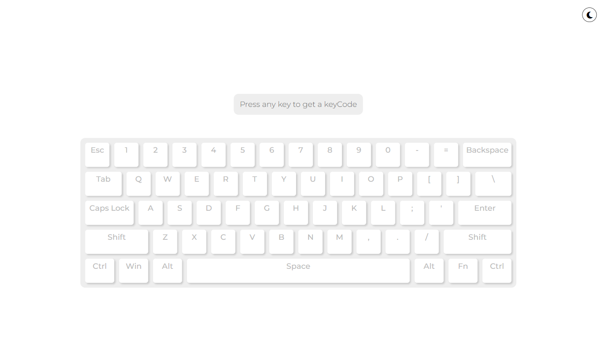
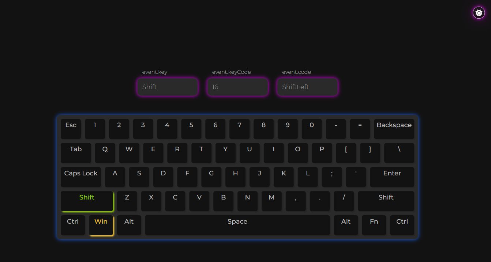

# Keyboard App

This is a keyboard app that allows users to interact with a virtual keyboard interface. The app provides both dark mode and light mode themes for a customizable user experience.

## Features

- Virtual keyboard with various keys and functionalities.
- Dark mode and light mode themes for personalized preferences.
- Event handling for key press events.

## Technologies Used

- HTML
- CSS
- JavaScript

## Which Fronted aspects I have used and practiced

- key events: keydown and keyup
- animation
- dark and light mode
- local storage

## Installation

1. Clone the repository: `git clone https://github.com/your-username/keyboard-app.git`
2. Navigate to the project directory: `cd keyboard-app`
3. Open `index.html` in your preferred web browser.

## Usage

- The virtual keyboard is displayed on the screen.
- Click or tap on the keys to input characters or trigger specific functionalities.
- To switch between dark mode and light mode, click on the toggle button provided.

## Screenshots

_Keyboard App in Light Mode_

_Keyboard App in Dark Mode_

## Contributing

Contributions are welcome! If you find any bugs or have suggestions for improvement, please open an issue or submit a pull request.

## License

This project is licensed under the [MIT License](LICENSE).
